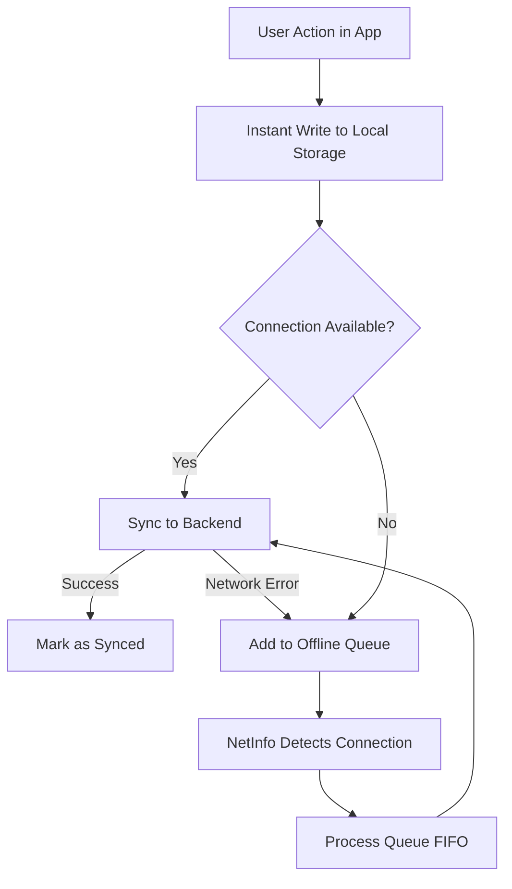

# SketchF

**SketchF** is a local-first mobile application designed for architects, engineers, interior designers, and construction professionals. It simplifies on-site measurements by allowing users to capture photos of rooms or environments, organize them by projects and folders, and draw interactive measurement lines (dimension annotations) with custom labels directly on top of the images.

Built with the constraints of connectivity-poor construction sites in mind, SketchF adopts a robust **Local-First** architecture. This ensures uninterrupted offline operation and seamless background synchronization once internet connectivity is restored.

---

## Download App
You can download the latest production release of the application directly as an APK for Android devices:

* **[Download SketchF APK (Android)](https://expo.dev/accounts/fluxyfp/projects/sketchf/builds/6e5c1602-a7c7-4fb9-b70c-67725fd83cf1)**

---

## Key Features

* **Interactive Annotation Canvas:** Tap to set start (A) and end (B) points to draw dimension lines. Add, edit, or delete custom measurement labels (e.g., "120 cm", "Pillar") by clicking on them.
* **Local-First Sync Engine:** Direct read/write access to local database (AsyncStorage) for instant UI response. Offline edits are queued (sync_queue) and synced automatically in the background when connection is restored.
* **Smart LRU Photo Cache:** Prevents device storage overflow by caching photos for only the 5 most recently accessed folders. Unsynced offline photos are protected and never evicted until safely uploaded to the cloud.
* **Auto-Discovery Network Scanner:** Scans the local subnetwork on port 3000 to automatically connect to a developer's local backend API during development, with an automatic fallback to the hosted cloud production API.
* **Dynamic Orientation Control:** Locks screen orientation to landscape or portrait in the canvas/viewer automatically based on the photo's aspect ratio.
* **Automatic Image Optimization:** Compresses on-site photos (70% quality, max 1080px width) before upload to save mobile data and storage.
* **Hierarchical Organization:** Organize drawings by Project (name, client, address) and Folder (rooms/items like "Kitchen", "Bathroom"). Folders can be easily moved between projects.
* **Secure Session Persistence:** Simple JWT authentication with persistent local storage so users don't need to log in every time.

---

## Local-First Architecture

---

## Tech Stack

### Frontend (Mobile App)
* **Framework:** React Native with Expo (SDK 54)
* **UI Component Library:** React Native Paper (Material Design)
* **Navigation:** React Navigation (Stack)
* **Local Storage:** @react-native-async-storage/async-storage
* **Device APIs:** expo-camera, expo-image-manipulator, expo-file-system, expo-screen-orientation

### Backend (Server)
* **Runtime:** Node.js + Express.js
* **Database:** PostgreSQL
* **Security:** JWT Auth & bcrypt encryption
